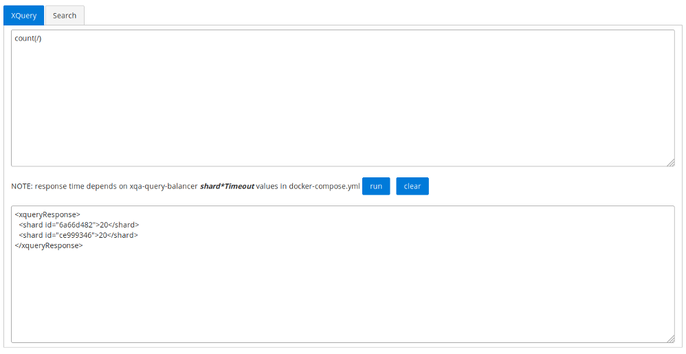
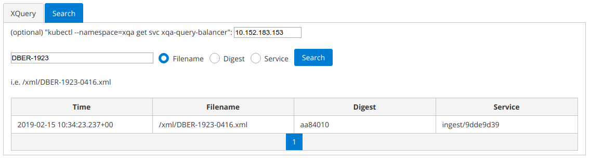

# xqa-query-ui [](https://travis-ci.org/jameshnsears/xqa-query-ui) [](https://coveralls.io/github/jameshnsears/xqa-query-ui?branch=master) [](https://sonarcloud.io/dashboard?id=jameshnsears_xqa-query-ui) [](https://www.codacy.com/app/jameshnsears/xqa-query-ui?utm_source=github.com&amp;utm_medium=referral&amp;utm_content=jameshnsears/xqa-query-ui&amp;utm_campaign=Badge_Grade)
* UI for querying XQA.

## 1. High Level Design


## 2. Screenshots





## 3. Install
* sudo apt purge npm
* sudo apt install npm
* npm install  # using package.json

### 3.1. (optional) Update package.json
```
npm install npm-check-updates

node_modules/npm-check-updates/bin/ncu

node_modules/npm-check-updates/bin/ncu -u
```

## 4. Build locally
```
./build.sh
```

## 5. Docker
### 5.1. Populate environment with data
* populate xqa-shard(s) and xqa-db using xqa-test-data:
```
./start.sh
```
* wait until data in xqa:
    * docker logs xqa-ingest | grep "FINISHED - sent: 40/40"
    * docker-compose logs -f xqa-shard | grep "size="

### 5.2. Bring up
* docker-compose up -d xqa-query-ui
* * visit: [http://127.0.0.1:8888](http://127.0.0.1:8888)

## 6. Run from CLI
* node_modules/@angular/cli/bin/ng serve --open

or

* node_modules/@angular/cli/bin/ng serve --open --env=prod

or

* node_modules/@angular/cli/bin/ng test

### 6.1. Debug in VSC
* Debugger for Chrome extension installed.
* In Debug Window, Launch Chrome (xqa-query-ui) & set a breakpoint.

## 7. Test
* visit: [http://127.0.0.1:4200](http://127.0.0.1:4200)

## 8. Teardown
```
./stop.sh
```
