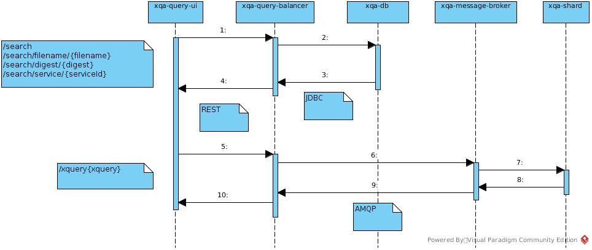

# xqa-query-ui [](https://travis-ci.org/jameshnsears/xqa-query-ui) [](https://coveralls.io/github/jameshnsears/xqa-query-ui?branch=master) [](https://sonarcloud.io/dashboard?id=jameshnsears_xqa-query-ui) [](https://www.codacy.com/app/jameshnsears/xqa-query-ui?utm_source=github.com&amp;utm_medium=referral&amp;utm_content=jameshnsears/xqa-query-ui&amp;utm_campaign=Badge_Grade)
* a simple web UI to run XQuery and for ad-hoc status / auditing queries.

## 1. High Level Design


## 2. Install
* supt apt purge npm
* sudo apt install npm
* npm install

### 2.1. (optional) Update package.json
```
npm install npm-check-updates
node_modules/npm-check-updates/bin/ncu
node_modules/npm-check-updates/bin/ncu -u
```

## 3. Docker
### 3.1. Build locally
```
node_modules/@angular/cli/bin/ng build --prod --build-optimizer
docker-compose -p "dev" build --force-rm
```

### 3.2. Bring up
* docker-compose -p "dev" up -d

## 4. Run from CLI
* node_modules/@angular/cli/bin/ng serve --open

or

* node_modules/@angular/cli/bin/ng serve --open --env=prod

or

* ngnode_modules/@angular/cli/bin/ng test

## 5. Test
* visit: [http://127.0.0.1/](http://127.0.0.1/)

## 6. Teardown
* docker-compose -p "dev" down -v
